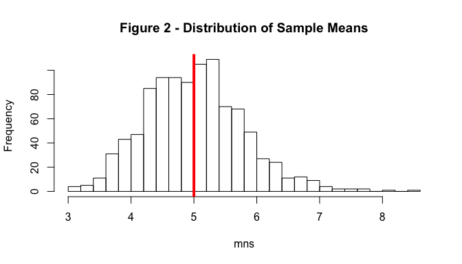
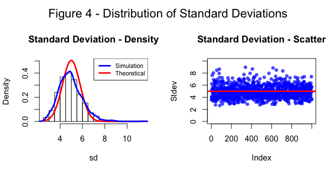
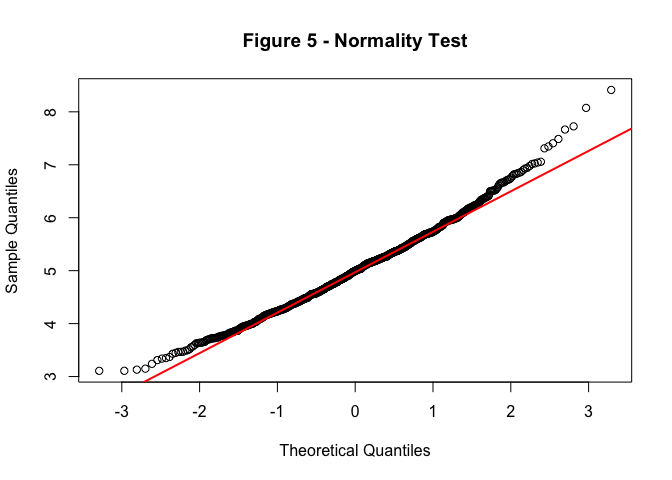

Simulating Exponential Distributions
================
<a href="http://www.ryantillis.com"> Ryan Tillis </a>
August 9, 2016

Synopsis
--------

R is loaded with powerful methods for simulating, modeling and analyzing data. In this document I give a basic simulation of exponential data and compare that data with a theoretical model.

### Simulation

We start by simulating 1000 trials with 40 observations each. This is accomplished using a for loop and the rexp() function. The means and standard deviations for each trial are saved in respective data frames.

``` r
lambda <- .2
n <- 40
s <- 1000

mns = NULL
sd = NULL
dat = NULL
for (i in 1:s) {
       set.seed(i)
       dat = c(dat, rexp(n, lambda))
       mns = c(mns, mean(rexp(n, lambda)))
       sd = c(sd, sd(rexp(n, lambda)))
}
```

#### Sample Mean vs Theoretical Mean

Using the data we can calculate the simulated and theoretical means.

``` r
sample_mean = mean(mns)
sample_mean
```

    ## [1] 5.011243

``` r
theor_mean = 1/lambda
theor_mean
```

    ## [1] 5

``` r
hist(mns, 22, main = "Figure 2 - Distribution of Sample Means")
abline(v=5,lw=4,col="red")
```



The results show that the sample mean is off by only .011. In the figure below we can further see that the distirbution of the means is approximately normal.


#### Sample Variance vs Theoretical Variance

Next we calculate the standard deviations and variances.

``` r
sample_var <- var(mns)
sample_var
```

    ## [1] 0.60981

``` r
theor_var <- (1/lambda^2)/n
theor_var
```

    ## [1] 0.625

The variances match up closely. Below is a chart comparing theoretical standard deviation distribution versus the standard deviation of the sample data.



Finally, we can test the normality using a q-q plot.



Appendix - Plot Codes
---------------------

``` r
plot(dat, pch = 16, col = adjustcolor("purple", alpha=0.05), ylim = c(0,25), ylab = "Variable", main = "Figure 1")
```

``` r
sample_mean = mean(mns)
sample_mean

theor_mean = 1/lambda
theor_mean

hist(mns, 22, main = "Figure 2 - Distribution of Sample Means")
abline(v=5,lw=4,col="red")
```

``` r
#FIGURE 3
par(mfrow=c(1,2))

#Generating histogram as a density function
hist(mns, 22, freq = FALSE)

#Fitting the theoretical line
xfit <- seq(min(mns), max(mns), length = 100)
yfit <- dnorm(xfit, mean = 1/lambda, sd = 1/lambda/sqrt(n))
lines(xfit, yfit, pch=22, lty = 1, lw = 3, col = "red")

#Fitting the line to the data
lines(density(mns), lw = 3, col = "blue")

#Adding a legend
legend('topright', c("Simulation", "Theoretical"), col=c("blue", "red"), lw=c(3,3), cex = .75)

#plotting the data on the mean for the 1000 simulations
plot(mns, main = "Mean", ylab = "Mean", xlim = c(0,s), ylim = c(0,10), xlab = "Mean", pch = 16, col = adjustcolor("blue", alpha=0.44))
abline(h=5, col = "red", lw =3)
```

``` r
par(mfrow=c(1,2), oma=c(2,0,2,0))
hist(sd, 22, freq = FALSE, ylim = c(0,.5), main = "Standard Deviation - Density")

#Fitting the theoretical line
xfit <- seq(min(sd), max(sd), length = 100)
yfit <- dnorm(xfit, mean = 1/lambda, sd = 1/lambda/sqrt(n))
lines(xfit, yfit, pch=22, lty = 1, lw = 3, col = "red")

#Fitting the line to the data
lines(density(sd), lw = 3, col = "blue")

#Adding a legend and title
legend('topright', c("Simulation", "Theoretical"), col=c("blue", "red"), lw=c(3,3), cex = .75)

mtext("Figure 4 - Distribution of Standard Deviations", outer = TRUE, cex = 1.5)

plot(sd, main = "Standard Deviation - Scatter", ylab = "Stdev", xlim = c(0,s), ylim = c(0,10),pch = 16, col = adjustcolor("blue", alpha=0.7))
abline(h=5, col = "red", lw =3)
```

``` r
qqnorm(mns, main= "Figure 5 - Normality Test")
qqline(mns, col="red", lw = "2")
```

Check out my website at: <http://www.ryantillis.com/>
