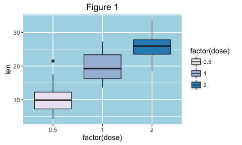
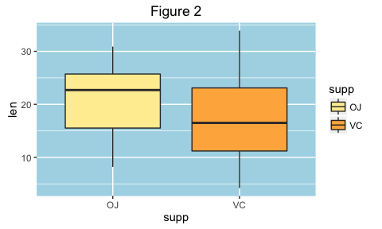
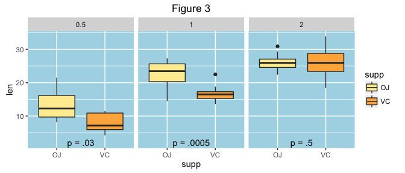

Exploratory Graphing and Hypothesis Testing
================
<a href="http://www.ryantillis.com"> Ryan Tillis </a>
August 9, 2016

Synopsis
--------

This is a brief graphical and numerical exploration of a data set. The goal is to summarize the data and perform hypothesis tests at 95% confidence intervals.

Loading the data
----------------

``` r
library(datasets)
library(ggplot2)
library(RColorBrewer)
library(grDevices)

data(ToothGrowth)
attach(ToothGrowth)

#A first look shows us that there are 3 variables and 60 observations
str(ToothGrowth)
```

    ## 'data.frame':    60 obs. of  3 variables:
    ##  $ len : num  4.2 11.5 7.3 5.8 6.4 10 11.2 11.2 5.2 7 ...
    ##  $ supp: Factor w/ 2 levels "OJ","VC": 2 2 2 2 2 2 2 2 2 2 ...
    ##  $ dose: num  0.5 0.5 0.5 0.5 0.5 0.5 0.5 0.5 0.5 0.5 ...

``` r
#Shows that the dose is in .5 increments with 3 unique levels - converted to factors
summary(ToothGrowth)
```

    ##       len        supp         dose      
    ##  Min.   : 4.20   OJ:30   Min.   :0.500  
    ##  1st Qu.:13.07   VC:30   1st Qu.:0.500  
    ##  Median :19.25           Median :1.000  
    ##  Mean   :18.81           Mean   :1.167  
    ##  3rd Qu.:25.27           3rd Qu.:2.000  
    ##  Max.   :33.90           Max.   :2.000

``` r
unique(ToothGrowth$dose)
```

    ## [1] 0.5 1.0 2.0

``` r
ToothGrowth$dose<-as.factor(ToothGrowth$dose)
```

Graphical Analysis
------------------

In this section we explore the relationship between dose size, dose type and tooth length.



``` r
aggregate(len,list(supp,dose),mean)
```

    ##   Group.1 Group.2     x
    ## 1      OJ     0.5 13.23
    ## 2      VC     0.5  7.98
    ## 3      OJ     1.0 22.70
    ## 4      VC     1.0 16.77
    ## 5      OJ     2.0 26.06
    ## 6      VC     2.0 26.14

**Figure 1** shows that as doseage increases so does tooth length.



**Figure 2** suggests that Orange Juice is generally more effective than vitamin C across all dose levels.

.

.

.

In **Figure 3** things get a little more interesting. For the first 2 doseage ranges, Orange Juice appears marginally more effective than vitamin C at stimulating tooth growth. For the 3rd dose it appears a push.



**Figure 3** shows that the difference between the first 2 dose ranges appears significant but at the highest dose of .5, the two supplements are equally effective. P-values attained from the numerical analysis section below are annotated onto the graph.

Conclusions
-----------

#### Reformatting Data

The first task is to transform the data into a useful format for computing confidence intervals. To do this I used the split funciton. From there the relevant columns can be pulled out of the list to perform t.tests.

``` r
#This operation splits the data frame by dose and supplement type. The result is a list 6 data frames each with 10 observations controlled for dose and supplement type.

split_tooth <- split(ToothGrowth, f = list(ToothGrowth$dose, ToothGrowth$supp))
```

#### Computing the Confidence Intervals

The following conclusions can be stated with 95% confidence levels. P-values are displayed below. Codes for the t.test are included in the appendix.

##### Is Orange Juice more effective than vitamin C across doses? <font size="+2"><span style="color:green">YES</span></font>

    ## [1] 0.03031725

##### Is Orange Juice more effective than Vitamin C for a .5 dose? <font size="+2"><span style="color:green">YES</span></font>

    ## [1] 0.003179303

##### Is Orange Juice more effective than Vitamin C for a 1 dose? <font size="+2"><span style="color:green">YES</span></font>

    ## [1] 0.0005191879

##### Is Orange Juice more effective than Vitamin C for a 2 dose? <font size="+1"> <span style="color:red">INCONCLUSIVE</span></font>

    ## [1] 0.5180742

##### Is a 2 dose (any supp) more effective than a .5 dose? <font size="+2"><span style="color:green">YES</span></font>

    ## [1] 6.341504e-08

##### Is a 2 dose more (any supp) effective than a .5 dose? <font size="+2"><span style="color:green">YES</span></font>

    ## [1] 2.198762e-14

##### Is a 2 dose more (any supp) effective than a .5 dose? <font size="+2"><span style="color:green">YES</span></font>

    ## [1] 9.532148e-06

### Appendix - Conf Int Codes

``` r
#Is Orange Juice more effective than vitamin C across doses? <span style="color:green">YES</span>
t.test(c(split_tooth[[1]]$len,split_tooth[[2]]$len,split_tooth[[3]]$len),c(split_tooth[[4]]$len,split_tooth[[5]]$len,split_tooth[[6]]$len), alternative = "greater")$p.value

#Is Orange Juice more effective than Vitamin C for .5 dose? YES
t.test(split_tooth[[1]]$len,split_tooth[[4]]$len, alternative = "greater")$p.value

#Is Orange Juice more effective than Vitamin C for 1 dose? YES
t.test(split_tooth[[2]]$len,split_tooth[[5]]$len, alternative = "greater")$p.value

#Is Orange Juice more effective than Vitamin C for 2 dose? Inconclusive
t.test(split_tooth[[3]]$len,split_tooth[[6]]$len, alternative = "greater")$p.value

#Is 2 dose more effective that .5 dose? YES
t.test(c(split_tooth[[1]]$len,split_tooth[[4]]$len),c(split_tooth[[2]]$len,split_tooth[[5]]$len), alternative = "less")$p.value

#Is 2 dose more effective that .5 dose? YES
t.test(c(split_tooth[[1]]$len,split_tooth[[4]]$len),c(split_tooth[[3]]$len,split_tooth[[6]]$len), alternative = "less")$p.value

#Is 2 dose more effective that .5 dose? YES
t.test(c(split_tooth[[2]]$len,split_tooth[[5]]$len),c(split_tooth[[3]]$len,split_tooth[[6]]$len), alternative = "less")$p.value
```

``` r
require(gridExtra)

theme <- theme(
  panel.background = element_rect(fill = "lightblue",
                                colour = "lightblue",
                                size = 0.5, linetype = "solid"),
  panel.grid.major = element_line(size = 0.5, linetype = 'solid',
                                colour = "white"), 
  panel.grid.minor = element_line(size = 0.25, linetype = 'solid',
                                colour = "white")
  ) 

#FIGURE 1
plot1 <- ggplot(aes(x = factor(dose), y = len), data = ToothGrowth) + geom_boxplot(aes(fill = factor(dose))) + theme + scale_fill_brewer(palette="PuBu") + labs(title = "Figure 1")

#FIGURE 2
plot2 <- ggplot(aes(x = supp, y = len), data = ToothGrowth) + geom_boxplot(aes(fill = supp)) + theme + scale_fill_brewer(palette="YlOrRd") + labs(title = "Figure 2")

grid.arrange(plot1, plot2, ncol=2)
```

``` r
#FIGURE 3
ggplot(aes(x = supp, y = len), data = ToothGrowth) + geom_boxplot(aes(fill = supp)) + facet_wrap(~ dose) + theme + scale_fill_brewer(palette="YlOrRd")+ labs(title = "Figure 3") + annotate("text", x = 1.5, y = 2, label = c("p = .03","p = .0005","p = .5"))
```

Check out my website at: <http://www.ryantillis.com/>
